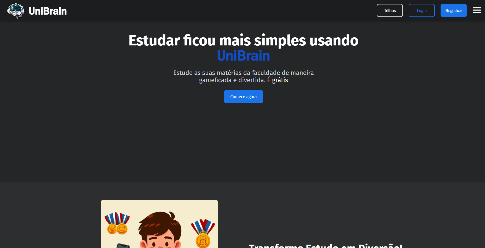
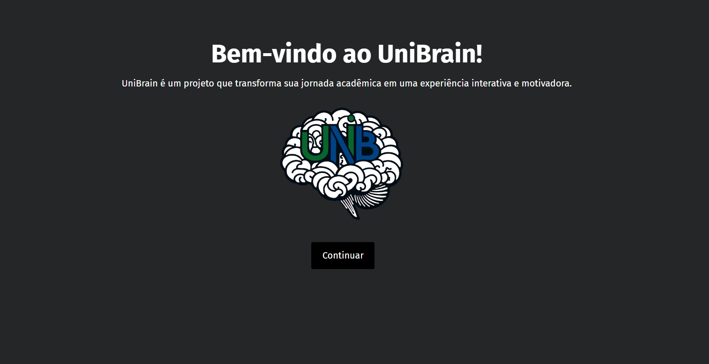
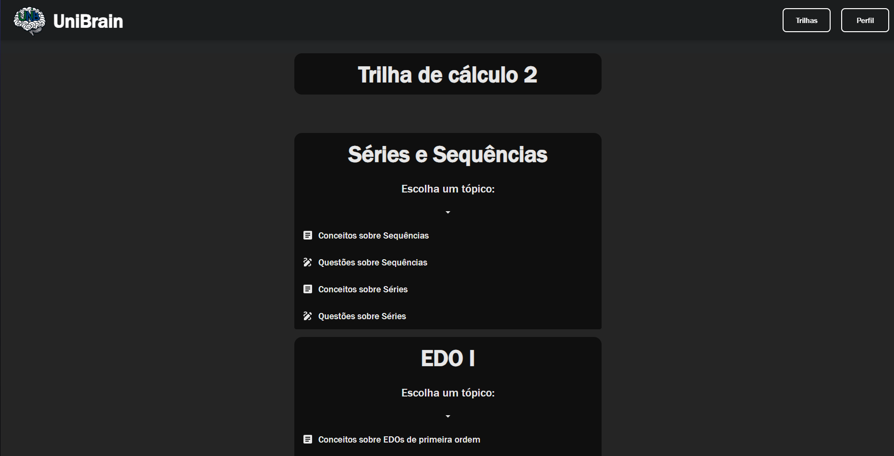
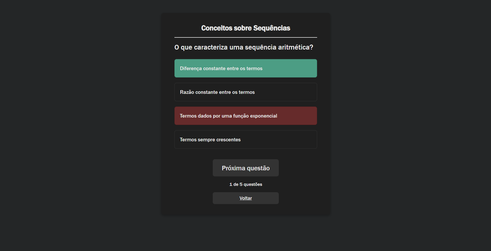
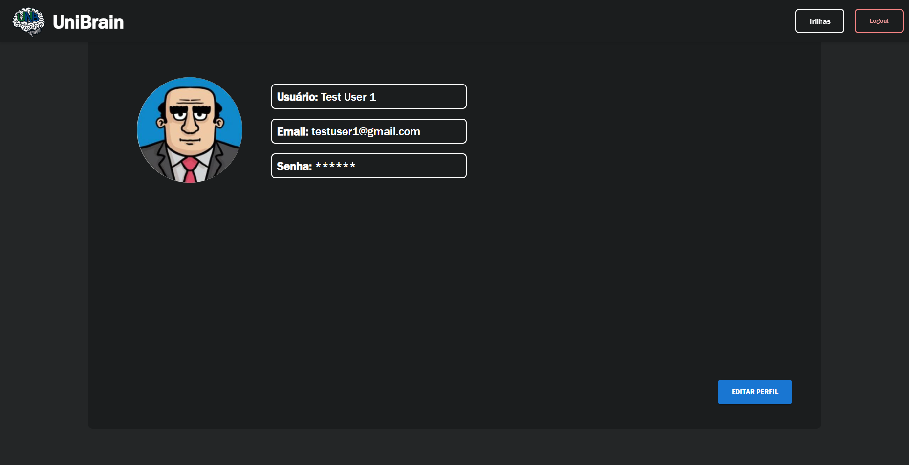

# 🎓 UniBrain - Iteractive Educacional Plataform

UniBrain is a smart educational platform designed to guide university students through personalized learning paths.

<p align="center">
  
</p>

## 🔍 Overview

UniBrain is a full-stack educational platform designed for **university students**, offering structured **learning paths** to gamify and enhance engagement with academic subjects. It combines a Django-powered backend with a modern React frontend stack.

This project was developed by second-semester Software Engineering students at the University of Brasília (UnB) as the final assignment for the *Software Development (DS)* course.

## 🚀 Features

- Personalized learning tracks for academic learning
- User authentication and progress tracking
- Modular full-stack architecture (backend + frontend)
- RESTful API integration
- Responsive user interface
- Includes 2 complete learning paths: Calculus II and Probability & Statistics

## 🖼️ Demo

### Home Page


### Welcome Quiz (#1 Login)


### Quiz Page


### Question Page


### Profile Page


## 📂 Project Structure

UniBrain/  
├── backend/                      # Django backend (API, models, admin, etc.)   
│   ├── backend/                  # Core Django app folder (settings.py, urls.py, wsgi.py)  
│   ├── media/                    # User profile pictures (default and personalized)  
│   ├── templates/                # Email verification templates  
│   ├── user/                    # User model and related logic  
│   ├── venv/                     # Python virtual environment (dependencies)  
│   ├── db.sqlite3                # SQLite database file  
│   ├── manage.py                 # Django management script  
│   └── requirements.txt          # Python dependencies list  
│  
├── frontend/                     # React frontend  
│   ├── node_modules/             # Node.js packages  
│   ├── public/                  # Static assets (images, icons, etc.)  
│   ├── src/                      # React components and source code  
│   ├── eslint.config.js          # ESLint configuration  
│   ├── index.html                # Main HTML file  
│   ├── package-lock.json         # Exact versions of installed packages  
│   ├── package.json              # Project metadata and dependencies  
│   └── vite.config.js            # Vite build tool configuration  
│  
├── web_screenshots/              # Example screenshots of the project  
│  
├── .gitignore                   # Git ignore rules  
├── LICENSE                     # Project license  
└── README.md                   # Project overview and instructions  
## 🛠️ Technologies Used


**Frontend:**
-   
-   
-   
- React 
- React Router DOM 
- Axios
- MUI
- Vite
- ESLint
- Other Dependecys

**Backend:**
-   
- Django
- Django REST Framework 
- SQLite (default)
- Other Dependecys

**Other Tools:**
-   
-   
- 


## ⚙️ Setup (Running Locally)

### Backend
```bash
cd backend
python -m venv venv         # (First time running)
venv\Scripts\activate       # On Windows
# source venv/bin/activate  # On Linux/Mac

pip install -r requirements.txt  # (First time running)

# Optional, if you make model changes
# python manage.py makemigrations
# python manage.py migrate

python manage.py runserver
```
- Then open your backend URL (default: http://127.0.0.1:8000/)
### Frontend
```bash
cd frontend

# Install dependencies (First time running)
npm install

# Start development server (First time running)
npm run dev
```
- Open your browser at http://localhost:5173 (default Vite URL)
## 🙋‍♂️ Team

<table>
  <tr>
    <td align="center">
      <a href="https://github.com/TiagoSBittencourt">
        
        <br /><sub><b>Tiago Bittencourt</b></sub>
      </a>
      <br /><span>Leader • Backend & Integration</span>
    </td>
    <td align="center">
      <a href="https://github.com/Mrn-Jr">
        
        <br /><sub><b>Mariano Junior</b></sub>
      </a>
      <br /><span>Backend & Integration</span>
    </td>
    <td align="center">
      <a href="https://github.com/Lucasft16">
        
        <br /><sub><b>Lucas Fujimoto</b></sub>
      </a>
      <br /><span>Frontend Developer</span>
    </td>
    <td align="center">
      <a href="https://github.com/Bercacos">
        
        <br /><sub><b>Bernardo Broeto</b></sub>
      </a>
      <br /><span>Frontend Developer</span>
    </td>
    <td align="center">
      <a href="https://github.com/HouNst7">
        
        <br /><sub><b>Elias Gomes</b></sub>
      </a>
      <br /><span>Frontend Developer</span>
    </td>
  </tr>
</table>

## 📄 License

This project is licensed under the MIT License.
